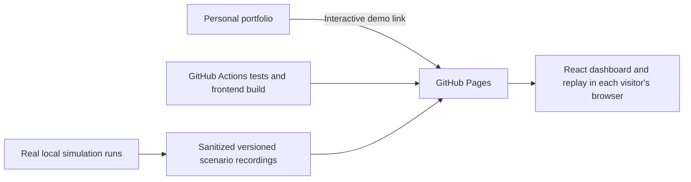

# HarbourSense portfolio implementation plan

Implementation ledger updated 10 September 2026. Checked items have local evidence; fresh GitHub CI and public deployment remain explicit release gates. See [release verification](docs/verification.md).

**Confirmed scope update:** the personal website does not exist yet. Finish HarbourSense and its standalone free public demo first. Provide its demo URL, screenshots, and case-study material ready for the future website; building that website and adding its links are a later task, not a prerequisite for this release.

**Outcome**

A visitor can open the standalone HarbourSense demo, run or explore a guided demonstration without installing anything, understand how a smart port responds to events, and inspect evidence that the system behaves correctly. The future personal portfolio website will link to this demo. The public demo runs independently of the developer's laptop with $0 recurring hosting cost. The first public deployment uses GitHub Pages with clearly labeled recorded scenarios and browser-local playback controls. A reviewer can also reproduce the complete backend locally from a fresh clone and explain the architecture from the repository documentation.

Assumed audience: reviewers of a full-stack, backend, or IoT software engineering portfolio. Priorities are an understandable demonstration, reliable execution, and measured engineering results.

**Starting point**

- The canonical project for this plan is this newer `HarbourSense/HarbourSense` repository. The running dashboard comes from this copy; the older HarbourSense folder is a separate checkout.
- Existing strengths include MQTT contracts, streamed device updates with REST fallback, shipment lifecycle logic, congestion-aware routing, maintenance handling, unit and broker tests, and CI definitions.
- The local API currently serves 25 graph nodes and 10 devices from an isolated sample database. The simulator is not running; there are no live sensor readings or shipments in that run.
- The `.local-runtime` launcher is a machine-specific recovery setup. It depends on a Python environment in the older checkout and is not the intended portable demo distribution.
- The current UI can label static sample data as “Live.” Its map needs a better initial overview, and its sidebar has competing scroll areas.
- There are substantial existing uncommitted changes. Implementation must start by reviewing and preserving them, including untracked source and tests.

**Release sequence**

| Milestone | Deliverable | Completion gate |
| --- | --- | --- |
| 0. Reproducible foundation | One supported local startup command | Fresh clone starts the isolated demo and passes readiness checks |
| 1. Normal-operation scenario | Repeatable shipment journey and reliable controls | Start, pause, resume, speed, and reset have verified semantics |
| 2. Portfolio dashboard | Clear overview, guided journey, useful details | A new viewer can identify the current operation and its outcome |
| 3. Reliable first release | Recovery handling and an automated complete journey | Fresh-stack CI and browser journey pass |
| 4. Standout scenarios | Congestion and crane-fault demonstrations with evaluation | Repeatable scenarios produce traceable outcomes and measured results |
| 5. Free portfolio publication | Standalone GitHub Pages demo, link ready for the future personal site, video, and engineering case study | Public HTTPS demo works with the developer laptop off, needs no backend connection, and has $0 recurring hosting cost |

The first portfolio-ready local release is milestones 0–3. Milestones 4–5 add the strongest interview material and public presentation. UI layout work can proceed alongside the scenario engine after their state contract is agreed.

**0. Make startup reproducible**

- [x] Inventory the current changes and identify the source baseline. Preserve the older checkout and existing databases; document which repository is authoritative.
- [x] Add a root `npm run demo` entry point backed by a portable orchestration script such as `scripts/demo.mjs`. Add `demo:status`, `demo:stop`, and a separately guarded `demo:reset` action.
- [x] Use a dedicated demo Compose definition and Compose project name, with explicit local MongoDB and MQTT settings. It must not read the existing Atlas `.env` or rely on global environment variables selecting a database.
- [x] Run the API, manager, simulator, sensor publisher, and analyzer with the local broker/database. Reuse their existing code and Dockerfiles; allow readiness and failures to be reported per service.
- [x] Bind development ports to localhost. Check Docker availability, port conflicts, configuration, and service readiness. Report actionable errors instead of silently substituting another project or data source.
- [x] Seed only a verified new demo database. Re-running startup preserves the active demo; resetting is explicit and limited to the owned demo environment.
- [x] Align tested Node/Python versions and runtime configuration across Docker, CI, and documentation. Create a committed example configuration with local defaults.
- [x] Replace the README's conflicting Mongo startup instructions with one verified quick start. Keep a separate troubleshooting section for machine prerequisites such as Docker failing to start.

Acceptance: from a fresh clone with documented prerequisites, one command starts all required services, `/health/ready` succeeds, and the graph API returns the expected fixture. Stop affects only this demo project. Starting again works without manual edits or references to either developer checkout.

Primary areas: `docker-compose.yml`, new demo Compose definition, root package scripts, `scripts/`, `.env.example`, `README.md`, backend health endpoints.

**1. Build the guided normal-operation scenario**

- [x] Define a versioned scenario specification: fixed seed, fleet and graph fixture, shipment schedule, expected lifecycle, default speed, and terminal conditions. Target a roughly 90-second normal demonstration at its default speed, then measure the actual duration.
- [x] Give each run a unique identity and each control/event a stable identifier. Include scenario ID, sequence, simulated time, and wall-clock time in the event record. Scope these changes to demo execution while retaining existing live-mode behavior.
- [x] Drive the existing simulator → MQTT → manager → MongoDB → API/stream → dashboard path. Seed fixtures establish starting conditions; scenario events must exercise the actual processing logic.
- [x] Define the control contract before building buttons: `idle`, `starting`, `running`, `paused`, `resetting`, `complete`, and `failed`, with permitted transitions and structured errors.
- [x] Establish a shared simulation-time contract across Node and Python. Audit movement, task deadlines, shipment generation, and sensor timers. Pause freezes simulated progress; health checks and connection recovery continue using real time. Keep database retention timestamps on wall-clock time. Speed changes affect future progress consistently without jumping completed work backward.
- [x] Implement start, pause/resume, speed presets, and reset. Commands are acknowledged and safe to retry; the UI shows the acknowledged state.
- [x] Make reset stop the run and its producers before restoring owned demo data. Reject late events from the previous run, then initialize the new run before resuming consumers.
- [x] Record a short event timeline explaining shipment arrival, assignment, movement, storage, and completion. Show a visible scenario completion state.

Acceptance: repeated runs with the same seed produce the same intended lifecycle and terminal state; exact network timing need not be identical. Pause produces no simulated movement or new shipment work. Resume completes normally without a burst of accumulated timer callbacks. Duplicate commands do not duplicate shipments. Reset during an active task leaves no old-run assignments or late updates in the new run.

Primary areas: `port-sim/lib/`, scenario runner/specifications, `python-backend/manager.py`, task and routing helpers, MQTT contracts, new demo-control API, dashboard state provider.

**2. Make the dashboard explain the operation**

- [x] Add an overview row for throughput, active fleet, delayed shipments, and critical alerts. Define each metric's time window and source; distinguish unavailable data from a measured zero.
- [x] Make the full port visible on initial load. Use recognizable dock, berth, road, warehouse, and gate treatments, with readable labels and a selected-route highlight.
- [x] Reduce competing sidebar scroll areas. Keep a compact searchable/filterable fleet list and open device/shipment details in a drawer. Preserve useful existing diagnostics behind clear labels.
- [x] Add the guided scenario panel and an event timeline that follows the selected shipment. Display the next expected step and explain delays or failures.
- [x] Show data mode and health independently: Demo/Live describes the source; Connecting/Healthy/Reconnecting/Stale/Failed describes freshness and delivery. A healthy HTTP response alone must not imply active telemetry.
- [x] Add data-age information, retry actions, useful empty states, and clear scenario completion/failure messages. Define freshness thresholds separately for device telemetry and slower panels.
- [x] Finish product details: HarbourSense page title/favicon, consistent spacing and icons, keyboard navigation, labeled device markers, drawer focus management, Escape handling, reduced-motion support, and a usable narrow-screen layout.

Acceptance: a new viewer can identify what is moving, why it is moving, and whether an issue needs attention. Validate at desktop, laptop, and mobile widths. The map starts with a useful overview, overlays do not hide essential controls, and all primary controls work with a keyboard. Paused demo data and disconnected live data are labeled accurately.

Primary areas: `dashboard/visualizer/src/App.js`, `dashboard.css`, `StatusPanels.js`, `DeviceDetailModal.js`, `nodes/`, `map/`, `state/`, `viewModels/`, and public page metadata.

**3. Prove the first release works and recovers**

- [x] Correct existing CI setup: provide the demo environment explicitly and replace the blanket MongoDB URI text scan, which matches legitimate validators and its own command, with credential-aware secret detection.
- [ ] Keep existing unit, contract, and broker tests. Add a fresh-stack job that boots the isolated demo, seeds it, and runs the existing read-API smoke checks.
- [x] Add an integration check using real MongoDB and MQTT: run one shipment through its complete supported lifecycle and verify final storage/assignment state. Bound its duration and collect logs on failure.
- [x] Add browser tests for demo start, visible progress, selection/details, completion, and reset. Retain Playwright traces on failures for browser state and network inspection.
- [x] Test API restart, broker interruption, and temporary database unavailability during a run. Reconnect/resubscribe automatically with bounded backoff, reconcile a fresh snapshot, and prevent duplicate task execution or shipment state regression.
- [x] Test a connection that stays open while telemetry stops. Mark it stale and recover when updates resume; also verify recovery from initial graph-load failure without requiring a page refresh.

Acceptance: a fresh CI environment passes the full journey, and injected interruptions recover within a documented budget or produce an actionable terminal error. No stale run mutates a new run, and reconnect does not duplicate completed work. Record tested versions and actual CI results; existing workflow files alone do not count as evidence.

Reference: [Playwright Trace Viewer](https://playwright.dev/docs/trace-viewer).

**4. Demonstrate and measure the smart behavior**

Congestion scenario:

- [x] Inject a repeatable bottleneck and show the affected route, chosen alternative, and explanation.
- [x] Compare the current congestion-aware strategy with the existing unweighted routing baseline under identical workload, fleet, graph, and random seeds.
- [x] Run multiple seeds/repetitions and report delivery-time distribution, throughput, route changes, failures, and unfinished shipments. State the hardware, workload, run duration, and measurement definitions. Separate simulated operational time from real API latency.

Crane-fault scenario:

- [x] Generate healthy and combined overheating/vibration-fault telemetry through the actual pipeline. Separate overheating and vibration labels are covered by the offline evaluation; the public scenario demonstrates the combined fault.
- [x] Show sensor trends, anomaly score, alert context, and the existing maintenance/repair response on the map and timeline. Explain observed feature deviations without presenting them as a causal model explanation.
- [x] Evaluate the current IsolationForest against simple thresholds on held-out sequences/seeds. Report precision, recall, false-alarm rate, and detection delay with the labeling method and class balance.
- [x] State clearly that training and evaluation data are synthetic and describe the limits of any real-world claims.

Acceptance: both scenarios are repeatable and reset cleanly. Every published result can be regenerated from saved scenario inputs and an evaluation command. Results may favor the baseline; explain that outcome instead of selecting only favorable runs. Avoid claiming advance failure prediction unless the experiment actually measures it.

Primary areas: `python-backend/traffic_analyzer.py`, `port-sim/lib/crane-telemetry.js`, `edge-analyzer/model_utils.py`, maintenance handling, scenario definitions, and evaluation scripts/reports.

**5. Package the portfolio story and publish it**

- [x] Rewrite the README opening around the problem, what a visitor can try, and the demonstrated outcome. Keep installation details accessible below it or in a dedicated guide.
- [x] Add an architecture diagram and a shipment/fault sequence diagram. Explain MQTT, SSE with polling fallback, the data model, task ownership, and recovery tradeoffs.
- [x] Document personal contributions and any team contributions accurately, plus limitations and future work.
- [ ] Record a 60–90 second walkthrough, capture polished screenshots, and publish reproducible benchmark/evaluation artifacts with their inputs.
- [x] Build the first public demo as a GitHub Pages deployment with recordings from the real local scenarios. Reuse the dashboard through live/replay data adapters and label the public mode as recorded simulation.
- [x] Provide scenario selection, device inspection, pause/resume, playback speed, and reset entirely within each visitor's browser. The published demo must not require the local API or share mutable playback state between visitors.
- [ ] Add a tested GitHub Actions build/deployment workflow, configure the Pages repository subpath, and publish only the approved frontend and synthetic scenario assets over HTTPS.
- [ ] Prepare the standalone “Interactive demo” URL, repository link, and case-study material for the future personal site. Use the included hosting address to retain $0 recurring hosting cost. Add the buttons when that website is built in a later task.
- [ ] Verify the published demo from another device/network with the developer laptop off. Check scenario playback, mobile/keyboard access, independent resets, and absence of localhost or external-backend requests.
- [x] Keep actual full-backend hosting as an optional later task, conditional on eligible free VM capacity and an explicit decision to operate it. The public Pages demo must remain usable independently.

Acceptance: an unauthenticated visitor can open the standalone demo URL, play and inspect the recorded scenarios, and reset their own session while the developer laptop is off. Hosting has $0 recurring cost under the selected free plan; no paid add-ons or expiring trial credits are required. Another engineer can reproduce the full local system and documented results. Public claims match measured evidence, and playback is clearly labeled as recorded simulation. Building the personal website and adding its demo link are deferred to a later task.

**Public deployment design for milestone 5 — zero recurring cost**

User requirement: a public demonstration linked from the personal portfolio, available while the developer laptop is off, with $0 recurring hosting cost and very low expected visitor traffic. A paid plan or temporary trial credit does not satisfy the ongoing budget. Use an included hosting subdomain or an already-owned domain.

Planned first public release: keep the code and deployment automation on GitHub and publish the React dashboard with a clearly labeled browser-based replay on GitHub Pages. Generate the replay data from the real local scenarios and reuse the existing dashboard presentation. Visitors can select a scenario, inspect devices, pause, change playback speed, and reset their own playback. The full Python/MongoDB/MQTT system remains reproducible locally and supplies the scenario recordings and engineering evidence.

This first release provides a public interactive portfolio demonstration; the Python backend does not run on the Pages hosting server. Actual online execution of the complete backend is an optional follow-up using an eligible Oracle Always Free virtual machine if capacity is available. No optional VM account or full-backend deployment has been created.

[GitHub Pages](https://docs.github.com/en/pages/getting-started-with-github-pages/what-is-github-pages) can host the compiled React site or an interactive browser replay, but cannot run the Python API, MongoDB, MQTT broker, or persistent simulation workers. [GitHub Actions can build and publish container images](https://docs.github.com/en/actions/tutorials/publish-packages/publish-docker-images); the server runs them continuously.

Recommended zero-cost public-demo path:

Hosting options, checked against official documentation on 10 September 2026:

| Option | Fit for HarbourSense | Cost context |
| --- | --- | --- |
| GitHub Pages with a browser replay — recommended for the public portfolio | Hosts compiled React and scenario recordings; browser interaction works without an API server | [Free for public repositories on GitHub Free](https://docs.github.com/en/pages/getting-started-with-github-pages/what-is-github-pages), using the included github.io address and subject to Pages limits. Requires a replay adapter and explicit Replay labeling. |
| Cloudflare Pages with the same browser replay | Alternative static host if GitHub Pages is unsuitable for the selected repository/site arrangement | [Static asset requests are free and unlimited](https://developers.cloudflare.com/pages/functions/pricing/); build/platform limits still apply. Keep the deployment static so Workers/Functions usage is not needed. |
| Oracle Always Free VM with Docker Compose — conditional full-backend route | Could run the API, MongoDB, MQTT, and workers on one Linux VM; validate ARM compatibility and actual resource usage | [Always Free resources](https://docs.oracle.com/en-us/iaas/Content/FreeTier/freetier_topic-Always_Free_Resources.htm) are subject to capacity and idle-instance reclamation. [Signup generally requires a phone and credit card](https://docs.oracle.com/en-us/iaas/Content/FreeTier/freetier.htm). Restrict provisioning to eligible resources; do not assume permanent capacity or upgrade to a paid account to resolve availability. |

[Render's free web service](https://render.com/docs/free) sleeps after 15 minutes without inbound traffic and has an ephemeral filesystem, so that free web-service tier is not the proposed home for this continuously running stateful simulation. Serverless request handlers likewise do not replace the MQTT broker and persistent workers.

Low visitor traffic does not mean the full backend consumes no resources: running simulation workers continue generating and processing events. Idle reclamation makes a free VM less dependable for a rarely visited portfolio; the static replay remains usable independently of that server.

Static-demo deployment work in order:

1. Introduce a dashboard data-source boundary so live HTTP/SSE and recorded scenarios feed the same reducers and view models. Keep live mode available for local engineering demonstrations.
2. Record normal, congestion, and crane-fault scenarios from the real pipeline. Store versioned, compact, synthetic-data-only snapshots/events and their scenario inputs. Label playback as recorded simulation; do not imply that a hosted model is producing the recorded predictions.
3. Add browser-local playback time and scenario controls. Keep recorded event time distinct from current wall-clock time and keep visitor state isolated. Define fixed prerecorded scenarios clearly; arbitrary new server-side scenario execution is outside this static mode.
4. Configure the React production build for the Pages repository subpath. The static demo selects its replay data source explicitly and must never connect to localhost or expect FastAPI/MQTT/MongoDB to be reachable.
5. Add a GitHub Actions job that tests and builds the demo and publishes only the compiled frontend and approved scenario assets to Pages. Configure Pages to use the deployment workflow. Review source/history before making a repository public; an already-public source repository can be used, or publish a separate sanitized demo repository if necessary.
6. Publish at the assigned HTTPS github.io address and document the demo link, source-code link, and case study. The personal website will be built later; its eventual “Interactive demo” button should open this standalone demo. A normal link gives the map its full viewport; embedding can be evaluated later.
7. Verify in a fresh browser with the local API stopped: the page loads, scenarios play, controls work, routes/assets resolve under the subpath, and no network requests target localhost or an external backend. Check two visitors can reset independently. Verify the published build from another device while the developer laptop is off.

Additional artifacts for this path: live/replay data adapters, a scenario recorder/export command, versioned replay fixtures, playback controls, a static-demo build configuration, a Pages deployment workflow, and a published-site smoke check.

Optional full-server deployment checklist, only if online backend execution is selected and eligible free VM capacity is available:

1. **Create a release configuration.** Add a production Compose definition that uses built images, a dedicated demo database/volume, service health checks, restart policies, and bounded resource/log retention. Keep the API, manager, simulator, sensors, and analyzer supervised separately. Initially run one API worker and one manager: the current API stream uses a fixed MQTT client identifier and must be adjusted before replicating it. Remove development source mounts, startup package installation, and API `--reload`.
2. **Make images safe to publish.** Add a `.dockerignore` to each build context. Exclude local `.env` files, certificates/keys, Python environments, local dependencies, logs, and recovery artifacts. Remove the explicit certificate copy from the simulator image and mount any needed credentials at runtime. Review repository history for previously committed credentials and rotate any exposed values before making code/images public.
3. **Serve the browser and API under HTTPS.** Use a reverse proxy such as Caddy to serve the compiled frontend and route `/api/*` to FastAPI without stripping the path. Keep the browser API same-origin; explicitly wire the production value into the frontend build. Today `REACT_APP_API_BASE_URL` is read during the React build, so setting it only when the finished container starts will not change its JavaScript. Verify the deployed bundle makes no localhost API requests.
4. **Limit public exposure to intended routes.** Keep MongoDB, MQTT, and workers on the internal container network. Expose the HTTPS gateway; restrict administrative access. Use same-origin access or an explicit CORS allowlist. Configure and verify SSE flushing, connection timeouts, heartbeat, and reconnection. Do not expose the existing `GET /analyze_sensors` as a read-only route: it computes results and inserts alerts.
5. **Choose visitor interaction deliberately.** For the earliest online release, a shared automatically running synthetic scenario can expose read-only exploration and its event timeline. Public pause/reset/fault controls follow when sessions have ownership, expiry, concurrency limits, and isolation. Visitors must not be able to reset another run. Keep the interactive local demonstration available throughout this rollout.
6. **Automate a tested release.** Have GitHub Actions run tests, build images, and publish immutable revision tags to GitHub Container Registry. Deploy a selected successful version using restricted deployment credentials; retain the previous image versions for rollback. Health and shipment checks must pass before declaring a release successful. Seed a new demo database only; never make every deployment reset persisted data.
7. **Connect the portfolio.** Configure the selected demo hostname and TLS, then add the live-demo button, repository link, case-study page, and short video to the personal site. Prefer a normal link for the first release so the map has the full browser viewport. A labeled replay/video remains accessible when the live demo is unavailable.
8. **Verify it as an outside visitor.** Load it over HTTPS from a separate device/network while the developer laptop is off. Verify a complete shipment, streamed device updates, no mixed-content/CORS/localhost failures, persistence through container restart, recovery after a worker restart, and a working rollback. Check the server's measured CPU/memory/storage and monthly spending settings before inviting traffic.

Proposed optional server artifacts: production Compose definition, gateway configuration, frontend build configuration, per-service `.dockerignore` files, deploy workflow, example server environment, deployment/rollback runbook, and a deployment smoke check. These are planned files, not existing deployment commands. The complete stack would run on the selected VM, not inside GitHub Pages or a permanent GitHub Actions job.

Gateway implementation references: [Caddy automatic HTTPS](https://caddyserver.com/docs/automatic-https) and [streaming proxy behavior](https://caddyserver.com/docs/caddyfile/directives/reverse_proxy).

**Suggested change batches**

1. Baseline inventory, demo configuration, startup/status/stop, and quick start.
2. Run identity, scenario specification, clock/control contracts, and reset isolation.
3. Normal scenario and control API with real-pipeline integration checks.
4. Dashboard overview, map, detail drawer, controls, and freshness states.
5. Fresh-stack CI, browser journey, reconnect/reconciliation, and first-release recording.
6. Congestion scenario and comparative routing evaluation.
7. Crane-fault scenario and anomaly evaluation.
8. Live/replay data-source boundary, scenario recordings, and browser-local playback.
9. GitHub Pages build/deployment workflow and independent public-demo acceptance checks.
10. Case study, diagrams, interactive-demo link, and portfolio publication. Add the full-server checklist only if that hosting route is selected.

For each batch, review the current diff first, preserve unrelated work, run the checks relevant to the changed behavior, and record the acceptance evidence. Add or update tests for meaningful behavior; visual/copy-only changes need focused visual verification.

**Decisions to confirm when they become relevant**

- Target role: the current order favors a full-stack/IoT portfolio; a backend role would give evaluation and recovery more prominence.
- Public hosting budget is fixed at $0 recurring, with GitHub Pages and browser-based recorded scenarios planned for the first public release. The existing public repository is `Daiyan-Khan/HarbourSense`; the standalone demo uses its included Pages address. There is no personal website yet; no domain or personal-site integration is required for this release. Actual server-side backend hosting remains an optional later decision.
- Contribution attribution confirmed: HarbourSense is a solo project. Credit it accordingly in the case study and future personal website.

Remaining release work is fresh GitHub CI, final portfolio media, Pages publication and verification of the deployed site. Local startup, scenarios, controls, evaluations and browser journeys have passed the checks linked in the verification ledger.
