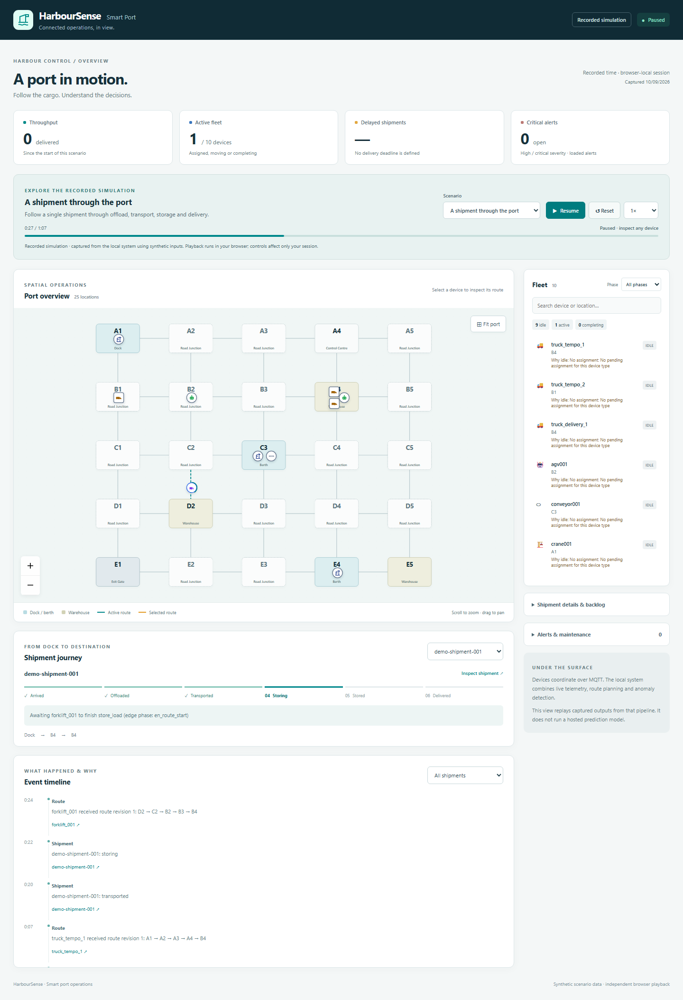
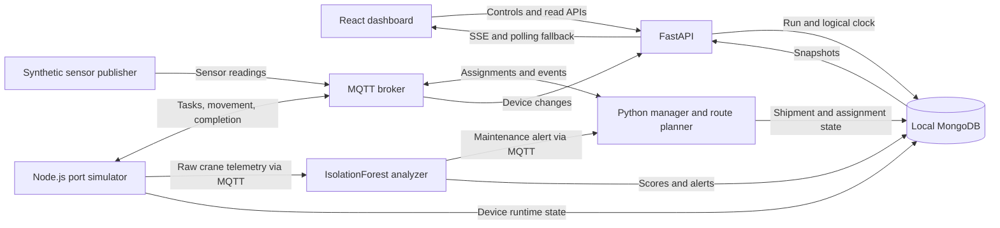

# HarbourSense

**Follow a shipment through a simulated port, inspect congestion, and see how unusual crane telemetry reaches a maintenance workflow.** HarbourSense connects a React operations dashboard to a Python manager, Node.js device simulator, MQTT broker and MongoDB.

The portfolio edition has two modes: a complete local engineering demonstration and a static recorded simulation for a free public site. The public build replays observations captured from the local pipeline; it does not run a remote Python backend or anomaly model.

[Local demo guide](docs/LOCAL_DEMO.md) · [Engineering case study](docs/CASE_STUDY.md) · [Measured evaluations](docs/evaluation.md) · [Release verification](docs/verification.md)

**Publication status:** screenshots, an [88-second walkthrough](docs/media/harboursense-walkthrough.webm), real scenario recordings and local recovery checks are complete. GitHub CI and public deployment are the remaining release gates. A personal portfolio website will be built later.



## Try the local system

Install **Node.js 24** and **Docker Desktop with Linux containers and Docker Compose**, then open a terminal in the repository directory containing this README and `package.json`:

```sh
npm run demo
```

The command builds and starts the isolated demo, checks its database, API, workers and dashboard, and prints readiness information. The first build can take several minutes. Open [localhost:3000](http://localhost:3000), choose a scenario, and press **Play scenario**.

No Atlas connection, AWS account, copied `.env`, host Python installation or separate seeding command is needed for this path. The launcher uses explicit local demo settings and its own Compose project/database. Root npm dependencies are only needed for the browser test tools, not for the startup command.

| Command | Purpose |
| --- | --- |
| `npm run demo` | Start the stack; preserve the existing demo data |
| `npm run demo:status` | Show the scenario and worker readiness |
| `npm run demo:logs` | Show recent service logs |
| `npm run demo:stop` | Request a pause, then stop this demo's services; preserve data |
| `npm run demo:reset -- --yes` | Explicitly replace only the owned demo run |

After an acknowledged pause and normal stop/start, the scenario stays paused until **Resume scenario** is selected. If shutdown reports that pause could not be acknowledged, inspect the run after restarting. See the [local guide](docs/LOCAL_DEMO.md) for port overrides, expected URLs, troubleshooting and verification limits.

## What to explore

| Scenario | Operation to follow |
| --- | --- |
| Normal | Shipment arrival, offload, transport, storage and delivery |
| Congestion | A fixed occupancy bottleneck entering the sensor and routing workflow |
| Crane fault | Synthetic overheating/vibration, anomaly scores, an alert and maintenance task |

Inspect devices, follow the shipment timeline, pause to examine a moment, change speed, and reset. The source label distinguishes the local simulation from recorded playback; connection health is a separate concern. Scenario definitions and the 25-node/10-device fixture are in [demo/](demo/).

## Architecture



The manager owns task assignments; the simulator owns physical movement. The API combines their views. Demo runs carry identities, retry-stable event IDs and logical time; old-run messages are rejected and writes are scoped to that run. The [case study](docs/CASE_STUDY.md) explains these boundaries and their limits.

## Evidence, including the baseline that wins

The reproducible experiments use saved synthetic inputs and the existing production classifier/planner code. They are **offline evaluations**, separate from end-to-end service tests.

| Experiment | Measured outcome | Scope |
| --- | --- | --- |
| Anomaly classification | IsolationForest recall **44.58%**; fixed range thresholds **92.58%** | 2,700 held-out synthetic samples; thresholds perform better on these faults |
| Congestion routing | Weighted strategy **54.2** completed deliveries versus BFS **47.0**, out of 60 | Mean across five seeds in a separate 600-second simulated transport model |

These results do not establish real-world fault prediction, API capacity or full-stack throughput. Precision, false alarms, missed samples, detection delay, unfinished deliveries, seed variation, machine details and reproduction commands are in [the evaluation report](docs/evaluation.md).

## Prepare the free public demo

With the complete local demo healthy, record the three scenarios. This intentionally resets the owned demo between runs:

```sh
npm run demo:record -- --yes
npm --prefix dashboard/visualizer ci
npm run demo:build
npm run demo:preview
```

Open [the static preview](http://127.0.0.1:4173/HarbourSense/). The build defaults to the `/HarbourSense` repository subpath and explicitly selects recorded playback. It requires validated recordings; missing or incomplete recordings produce an error instead of a fabricated demo.

GitHub Pages hosts the compiled dashboard and synthetic recordings. Each visitor controls their own browser playback; MongoDB, MQTT and Python remain part of the reproducible local system. GitHub Pages is available for public repositories on GitHub Free, using the included hosting address. No paid backend is required for this design. [GitHub Pages documentation](https://docs.github.com/en/pages/getting-started-with-github-pages/what-is-github-pages)

Publishing and testing the public HTTPS URL are separate release steps. See [the public-demo preparation guide](docs/LOCAL_DEMO.md#record-and-preview-the-static-demo) and [the implementation plan](PORTFOLIO_PLAN.md). Actual full-server hosting remains an optional later decision, outside the static demo's requirements.

## Verification and attribution

The repository includes backend, simulator, analyzer, tooling and browser checks. Use the [documented commands](docs/LOCAL_DEMO.md#verification) and inspect their output; workflow files alone are not proof that an end-to-end run passed. The current measured evaluation artifacts are linked above.

HarbourSense is a solo project by Daiyan Khan, covering the simulation, backend orchestration, anomaly analysis and dashboard. The [case study](docs/CASE_STUDY.md#contribution-attribution) explains the project scope and engineering decisions.
