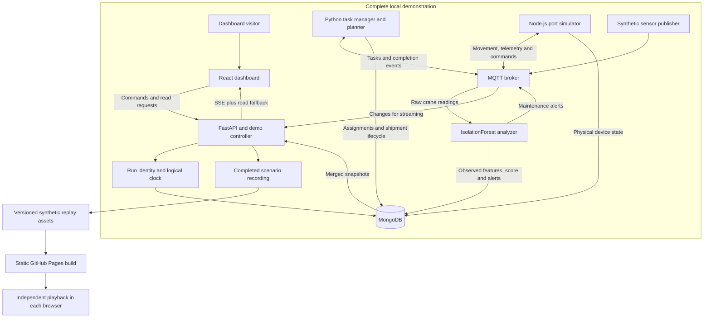
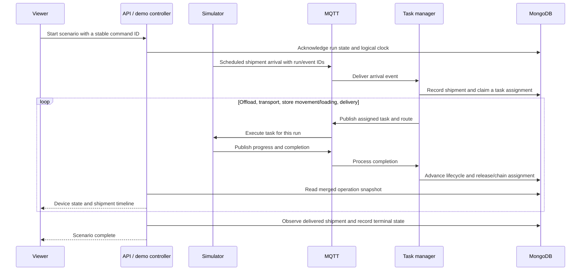
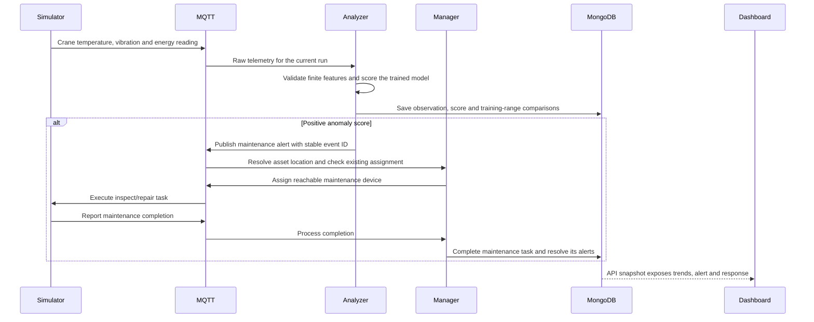
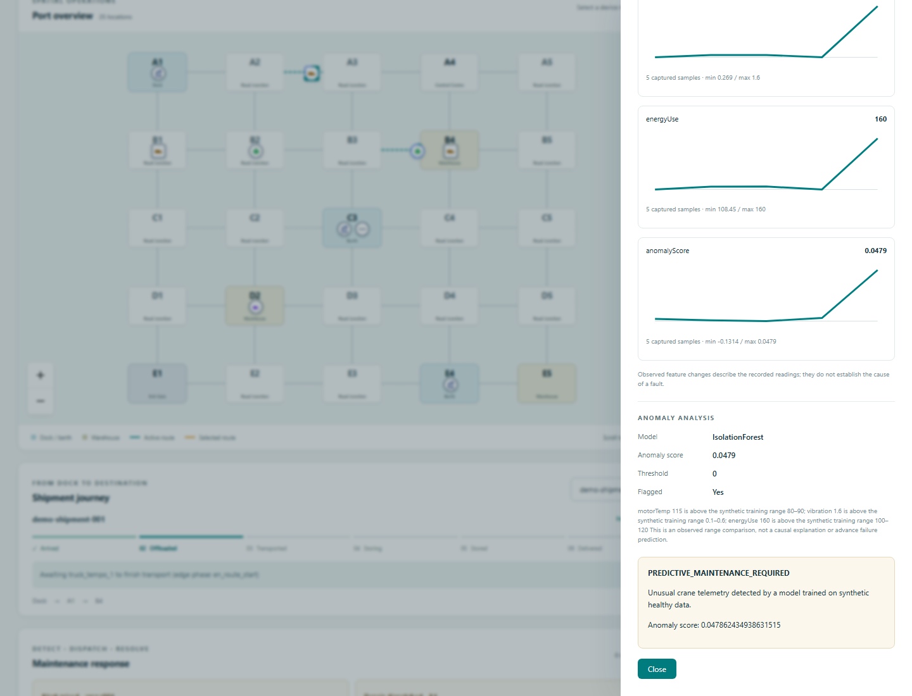

# HarbourSense: making a simulated port inspectable

HarbourSense models the movement of a shipment through a small port and exposes the events behind its progress. A viewer can follow assignment, movement, storage and delivery, then inspect what happens when a route becomes busy or crane telemetry becomes unusual.

The engineering problem is broader than drawing moving markers: several processes update different parts of the same operation. The dashboard needs a coherent account of what happened, who owns the next action, and whether the displayed data is current. The portfolio work connects that explanation to a reproducible local system and a free public recorded demonstration.

[Interactive demo](https://daiyan-khan.github.io/HarbourSense/) · [Watch the walkthrough](https://daiyan-khan.github.io/HarbourSense/media/harboursense-walkthrough.webm) · [Run it locally](LOCAL_DEMO.md) · [Evaluation evidence](evaluation.md) · [Source overview](../README.md)

## Demonstration and boundaries

The local system uses real MQTT and MongoDB services with synthetic shipments, device states and telemetry. It is a software simulation, not a connection to a real port or a validated industrial control system.

The public release provides static playback of snapshots/events recorded from that local pipeline. Visitors can inspect devices, choose a scenario, pause, change playback speed and reset their own session. They see recorded analyzer outputs; no hosted model is performing new inference in that mode.

| Scenario | What it is intended to demonstrate | Required outcome |
| --- | --- | --- |
| Normal operation | Assignment ownership and a complete shipment journey | Shipment reaches delivery through its supported phases |
| Congestion | A repeatable sensor bottleneck entering routing decisions | The actual route and operational outcome are inspectable |
| Crane fault | Telemetry scoring, alert context and the maintenance response | An observed alert and completed maintenance task, alongside shipment completion |

Definitions, seed and fixture are versioned in [demo/scenarios.json](../demo/scenarios.json) and [demo/fixtures.json](../demo/fixtures.json). Actual recording duration and terminal state are part of the recording evidence; a scenario description alone does not establish that its acceptance gate passed.

## Architecture and ownership

The Python manager decides assignments and routes. The simulator executes movement and reports progress/completion. Assignment and runtime records are separated, then merged for API consumers, which reduces competing writes to the same device fields. MongoDB provides snapshots for inspection and recovery; MQTT carries commands and events between workers.

The dashboard receives device updates through server-sent events, with polling/snapshot recovery available. This is an intentional compromise: viewers get timely movement without requiring every panel to use the same delivery mechanism. A reachable API and active telemetry are distinct facts, so source mode and connection freshness are shown separately.

The demo controller gives each run an identity and logical clock. Commands and events carry stable identities for retry handling. Run-specific collections and message fencing prevent a late event from an earlier reset from writing the next run's data. Pause/speed operate on simulation time; connection recovery, readiness and retention use wall-clock time.

These measures do not prove exactly-once behavior across every possible crash. Reconnection, persistent outbox/inbox handling, task completion guards and snapshot reconciliation need focused interruption tests as well as the normal journey.

## A shipment through the system

The final outcome is derived from recorded application state. It is not advanced by the dashboard's animation timer. In static mode the visitor's timer selects recorded frames; the source of those outcomes remains the local run.

## From crane telemetry to maintenance

The anomaly score is the negative of scikit-learn's `decision_function`; positive values cross the model's zero threshold. The explanation describes observed values relative to synthetic training ranges. It is not a causal explanation of model internals and does not show that a future failure was predicted.

## Design decisions and tradeoffs

| Decision | Reason | Practical limit |
| --- | --- | --- |
| MQTT between workers | Decouple producers, assignment logic and telemetry analysis through explicit event contracts | Delivery/reconnect behavior requires idempotency and reconciliation; broker availability still matters |
| Separate assignment and runtime ownership | Let the manager decide tasks while the simulator reports physical execution | Merged snapshots must be tested during transitions and recovery |
| MongoDB snapshots and run-scoped collections | Inspect persisted state and isolate reset runs | Retention and recovery remain operational concerns; an isolated local DB is not a production security design |
| Shared logical time | Make pause and speed meaningful across Node/Python workers | Forced shutdown/recovery behavior needs separate tests; real connection timeouts cannot use paused time |
| SSE with read fallback | Keep moving devices responsive while retaining snapshot recovery | Open connections can still carry stale data; freshness must be checked independently |
| Static public replay | Keep the portfolio usable without a running laptop or paid persistent backend | Visitors inspect fixed recorded scenarios; arbitrary server-side simulation is outside this mode |
| Include a simple anomaly baseline | Test whether the more complex model provides value | Synthetic evaluation cannot establish industrial reliability or real fault prevalence |

## What the measurements show

The [evaluation report](evaluation.md) includes saved inputs, predictions/events, configuration, machine details, source hashes and commands that reproduce the results. The two experiments are offline; neither measures the complete service stack.

**Anomaly detection:** 2,700 held-out synthetic samples contain 1,500 healthy and 1,200 fault-labeled observations across five seeds. IsolationForest precision is **94.86%**, recall **44.58%**, and false-alarm rate **1.93%**. Fixed normal-range thresholds achieve **100%** precision, **92.58%** recall and **0%** false alarms in this experiment. Median first-detection delays are **13.5** and **7.5 simulated seconds** respectively. Both methods detect each fault episode at least once, but the forest misses many individual faulty samples.

This result favors the baseline. The injected faults gradually leave known healthy ranges, so range thresholds are a strong fit. The evidence supports keeping that comparison visible, not calling the model superior because it uses machine learning. Sensor drift, real operating noise and lead time before an actual failure were not evaluated.

**Routing:** five paired 600-second workloads use the actual weighted route planner and its existing unweighted BFS with an identical saved graph, workload and four-vehicle fleet. In the separate discrete-event transport model, weighted routing completes **54.2 ± 3.27** of 60 deliveries, versus **47.0 ± 3.39** for BFS. Unfinished deliveries average **5.8** and **13.0**; no runs report routing failure. Throughput averages **5.42** versus **4.70 deliveries per simulated minute**.

Weighted routing changes remaining route plans more often. The result concerns an idealized FIFO-edge transport workload with explicit bottlenecks; it does not establish those throughput gains through the real manager, crane workflow, MQTT or database. Full-stack journeys and interruption checks are separate evidence.

## Publication status and presentation artifacts

The target public release uses GitHub Pages and clearly labeled recorded playback. The included hosting address and a public repository on GitHub Free provide the planned $0 recurring static-hosting path. Pages serves static files; it does not execute the complete Python/MQTT/MongoDB system. [GitHub Pages documentation](https://docs.github.com/en/pages/getting-started-with-github-pages/what-is-github-pages)

The [87.84-second walkthrough](media/harboursense-walkthrough.webm) follows a real recorded normal shipment, pauses for device inspection, and resumes through delivery. [Desktop](media/harboursense-overview.png), [crane-fault](media/harboursense-crane-detail.png) and [mobile](media/harboursense-mobile.png) screenshots show the verified dashboard. [Capture provenance](media/capture.json) links their hashes to the three recordings. Desktop, 1280-pixel laptop and 390-pixel mobile layouts were visually inspected.

The [verification ledger](verification.md) links successful GitHub CI, local service recovery, Pages deployment and independent public browser checks. Published playback passed at desktop, laptop and mobile widths without backend requests. A literal physical second-device test with the laptop powered off has not been performed. The personal portfolio site and its links are a later task.

## Contribution attribution

HarbourSense is a solo project by Daiyan Khan. Its scope spans the port simulation, MQTT event contracts, Python orchestration and routing, MongoDB state, synthetic anomaly analysis, and React dashboard.

The portfolio work adds reproducible local startup, guided scenarios, run isolation and recovery checks, measured baseline comparisons, and a browser replay of actual recorded runs. The project uses the open-source libraries documented in its dependency manifests; the synthetic demonstrations and offline evaluations have the limits described above.

## Next evidence to collect

The real-pipeline recordings and bounded recovery checks are complete. Further model work should start with a better experiment and a defensible dataset, not tuning against the already reported held-out sequences. Full-backend public hosting can be considered separately if operating a persistent server becomes useful.

See [the implementation plan](../PORTFOLIO_PLAN.md) for the complete acceptance gates and [the local guide](LOCAL_DEMO.md) for the commands available today.
